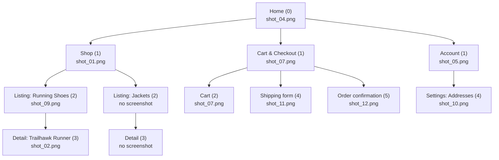

# Sitemap Report — Northline Goods (example)

Fictitious brand, fictitious screenshots. Shows the expected output shape
for `screenshot-sitemap`.

## Executive Summary

Northline Goods is a four-section e-commerce storefront with a healthy,
shallow IA (max depth 5, no orphan branches). The design reads current
(bento tiles, dark mode, micro-interactions) but the system underneath is
drifting: two primary blues, a radius outlier, no loading standard, and
the two highest-traffic templates (listing, checkout) carry the weakest
markup. Three quick wins ship without design involvement; the one
critical item is the under-labeled checkout form.

## 1. Input Summary

- Folder: `./shots` (12 files)
- Screenshots: `shot_01.png` … `shot_12.png`
- Excluded/unreadable: none
- HTML docs: `./html-audit` (3 files, 9 documented pages; 8 matched to
  screenshots, 1 documented page without a screenshot, 4 screenshots
  without a doc)

## 2. Depth-Normalized Tree

```text
Home (depth 0) — shot_04.png
├─ Shop (depth 1) — shot_01.png
│  ├─ Listing: Running Shoes (depth 2) — shot_09.png
│  │  └─ Detail: Trailhawk Runner (depth 3) — shot_02.png
│  └─ Listing: Jackets (depth 2) — (no screenshot captured)
│     └─ Detail (depth 3) — (no screenshot captured)
├─ Cart & Checkout (depth 1) — shot_07.png
│  ├─ Cart (depth 2) — shot_07.png
│  ├─ Shipping form (depth 4) — shot_11.png
│  └─ Order confirmation (depth 5) — shot_12.png
└─ Account (depth 1) — shot_05.png
   └─ Settings: Addresses (depth 4) — shot_10.png
```



## 3. Per-Node Table

| Depth | File | Title | Type | Trend tags | Evidence |
| --- | --- | --- | --- | --- | --- |
| 0 | shot_04.png | Home | home/landing | full-bleed hero, dark mode | no breadcrumb, top nav all inactive, single hero banner |
| 1 | shot_01.png | Shop | section hub | bento-grid category tiles | nav item "Shop" highlighted, 4 mixed-size category tiles |
| 2 | shot_09.png | Running Shoes | listing/search-results | skeleton loaders absent (spinner only) | breadcrumb "Home > Shop > Running Shoes", grid of 24 similar items |
| 3 | shot_02.png | Trailhawk Runner | detail/record | micro-interactions on size selector | breadcrumb "Home > Shop > Running Shoes > Trailhawk Runner", one product, full attribute panel |
| 1 | shot_07.png | Cart | section hub / cart | sticky mobile summary bar | nav "Cart" highlighted, single order summary, no category tiles |
| 4 | shot_11.png | Shipping details | transactional/form | inline validation micro-interaction | single-purpose form, "Back to Cart" affordance, no breadcrumb |
| 5 | shot_12.png | Order confirmed | terminal/edge-state | confetti micro-animation | success iconography, order number, no further nav depth |
| 1 | shot_05.png | Account | section hub | command palette absent | nav "Account" highlighted, tabbed sub-sections visible |
| 4 | shot_10.png | Addresses | account/settings | — | sub-tab "Addresses" active within Account, single-purpose list+form |

## 4. Conflicts / Low-Confidence Flags

- `shot_07.png` — cardinality reads as depth 1 (section entry) but the
  sticky checkout summary bar suggests depth 2 behavior. Kept at depth 1
  as the entry point for the Cart & Checkout branch; flagged for human
  confirmation.
- Jackets listing and its detail page were not captured in this screenshot
  set — rendered as placeholder nodes so the Shop branch stays aligned
  with the Running Shoes branch at the same depths.

## 5. Trend Alignment Summary

**Present:** full-bleed hero on Home, bento-grid category tiles on Shop,
dark mode support, inline form validation micro-interactions, a sticky
mobile cart summary.

**Dated:** the Running Shoes listing (`shot_09.png`) uses spinner-only
loading with no skeleton state, and no command-palette or search-first
entry point exists anywhere in Account or Shop navigation.

**Recommendations:**

1. Add skeleton loaders to the Running Shoes listing (`shot_09.png`) to
   match the perceived-performance bar set by the Home hero.
2. Introduce a Cmd+K style command palette at the Shop section hub
   (`shot_01.png`) — the category count already justifies search-first
   navigation.
3. Extend the confetti/success micro-animation pattern from Order
   Confirmation (`shot_12.png`) to the Addresses save action
   (`shot_10.png`) for interaction consistency.

## 6. Consulting (visual x markup cross-check)

**Executive summary.** The storefront looks current (bento tiles, dark
mode, micro-interactions) but the markup under the two highest-traffic
templates is behind the design: the listing grid ships no responsive/lazy
image attributes and the checkout form is only partially labeled. The
Detail template is the opposite — dated-looking but semantically solid —
so a visual refresh there is cheap. Two quick wins (breadcrumb JSON-LD,
`aria-current` on nav) can ship without design involvement.

**Scorecard per section**

| Section | Visual currency | Markup quality |
| --- | --- | --- |
| Shop / Listing | current | weak |
| Detail | dated | solid |
| Cart & Checkout | current | weak |
| Account | mixed | solid |

**Findings (prioritized)**

1. `critical` — Shipping form (`shot_11.png`, doc `checkout.md`): visible
   card-number and phone fields, but doc shows `<input type="text">`
   with no `label for=` or `autocomplete` — conversion and a11y risk on
   the money page. Recommend typed inputs + `autocomplete="cc-number"`,
   `tel`.
2. `major` — Running Shoes listing (`shot_09.png`, doc `listing.md`):
   24-item image grid, but doc shows plain `` with no `srcset`,
   `loading`, or dimensions — performance debt at the highest image
   count. Recommend `srcset` + `loading="lazy"` + width/height.
3. `quick-win` — Detail page (`shot_02.png`, doc `pdp.md`): breadcrumb
   visible in the screenshot, doc shows plain `<div class="crumbs">` —
   add `nav aria-label="breadcrumb"` + `BreadcrumbList` JSON-LD.
4. `quick-win` — All nav screenshots: active item styled visually, doc
   shows no `aria-current="page"` — state exists visually but not
   programmatically.

**Insufficient evidence.** `shot_04.png` (Home), `shot_05.png`,
`shot_07.png`, `shot_12.png` have no matching doc page; documented page
`/gift-cards` has no screenshot. These appear in the sitemap but are
excluded from cross-check findings.

## 7. Observed Design System

**Tokens (sampled, with source screens)**

| Role | Value (approx.) | Sampled from |
| --- | --- | --- |
| Primary action | #1A56DB | shot_04 hero CTA, shot_02 add-to-cart |
| Primary action (drift) | #2563EB | shot_11 "Continue" button |
| Surface | #F8FAFC | card backgrounds, shot_01/shot_09 |
| Text primary | near-#111 | all screens |
| Success | #16A34A | shot_12 confirmation |

Typography: geometric sans, weights 400/600/800; oversized display only
on Home. Radius family: 8px cards everywhere except `shot_10.png`
(sharp corners) — drift. Icons: line set, except filled icons in the
Account tab bar (`shot_05.png`) — mixed sets.

**Component matrix (excerpt)**

| Component | Screens | States captured | Drift |
| --- | --- | --- | --- |
| Primary button | 01, 02, 04, 11 | default, disabled (11) | two blues (above) |
| Product card | 01, 09 | default | consistent |
| Form input | 10, 11 | default, error (11 @ frame 0:58) | consistent |
| Modal/sheet | — | not observed | — |

**Maturity verdict.** Tokens: `drifting` (two primary blues, one radius
outlier). Components: `consistent` for cards/inputs, `drifting` for
buttons. Patterns: `ad hoc` (no captured loading standard: spinner on
shot_09, none elsewhere). Top systemization moves: unify primary blue,
codify the 8px radius, define one loading pattern.

## 8. UI/UX Guide

**Keep** — breadcrumbs at every depth >= 2 in Shop (shot_09, shot_02);
inline validation on shipping form (video frame @ 0:58); sticky cart
summary (shot_07).

**Change** — checkout entry has no visible step indicator (shot_11):
rubric item 1 (orientation); add a 3-step progress header. Listing uses
spinner-only loading (shot_09): rubric item 2 (status); adopt skeletons.
Icon-only tab bar in Account (shot_05): rubric item 5 (recognition);
add labels.

**Codify** — the 8px-radius card (9 of 12 screens) is the de facto
standard: write it down and migrate shot_10. One primary blue (#1A56DB,
majority) becomes the token; shot_11 adopts it.

## 9. Unified Roadmap

1. quick-win — breadcrumb `BreadcrumbList` JSON-LD on PDP (consulting #3)
2. quick-win — `aria-current` on active nav (consulting #4)
3. quick-win — unify primary blue to #1A56DB (design system)
4. major — skeleton loaders on listing (trend + UI/UX guide, shot_09)
5. major — `srcset`/lazy-loading on listing grid (consulting #2)
6. critical — label + autocomplete the checkout form (consulting #1)
7. structural — codify radius/loading standards into a written design
   system doc; add checkout step indicator (UI/UX guide)
