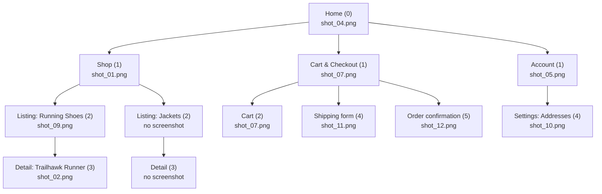

# Sitemap Report — Northline Goods (example)

Fictitious brand, fictitious screenshots. Shows the expected output shape
for `screenshot-sitemap`.

## 1. Input Summary

- Folder: `./shots` (12 files)
- Screenshots: `shot_01.png` … `shot_12.png`
- Excluded/unreadable: none

## 2. Depth-Normalized Tree

```text
Home (depth 0) — shot_04.png
├─ Shop (depth 1) — shot_01.png
│  ├─ Listing: Running Shoes (depth 2) — shot_09.png
│  │  └─ Detail: Trailhawk Runner (depth 3) — shot_02.png
│  └─ Listing: Jackets (depth 2) — (no screenshot captured)
│     └─ Detail (depth 3) — (no screenshot captured)
├─ Cart & Checkout (depth 1) — shot_07.png
│  ├─ Cart (depth 2) — shot_07.png
│  ├─ Shipping form (depth 4) — shot_11.png
│  └─ Order confirmation (depth 5) — shot_12.png
└─ Account (depth 1) — shot_05.png
   └─ Settings: Addresses (depth 4) — shot_10.png
```



## 3. Per-Node Table

| Depth | File | Title | Type | Trend tags | Evidence |
| --- | --- | --- | --- | --- | --- |
| 0 | shot_04.png | Home | home/landing | full-bleed hero, dark mode | no breadcrumb, top nav all inactive, single hero banner |
| 1 | shot_01.png | Shop | section hub | bento-grid category tiles | nav item "Shop" highlighted, 4 mixed-size category tiles |
| 2 | shot_09.png | Running Shoes | listing/search-results | skeleton loaders absent (spinner only) | breadcrumb "Home > Shop > Running Shoes", grid of 24 similar items |
| 3 | shot_02.png | Trailhawk Runner | detail/record | micro-interactions on size selector | breadcrumb "Home > Shop > Running Shoes > Trailhawk Runner", one product, full attribute panel |
| 1 | shot_07.png | Cart | section hub / cart | sticky mobile summary bar | nav "Cart" highlighted, single order summary, no category tiles |
| 4 | shot_11.png | Shipping details | transactional/form | inline validation micro-interaction | single-purpose form, "Back to Cart" affordance, no breadcrumb |
| 5 | shot_12.png | Order confirmed | terminal/edge-state | confetti micro-animation | success iconography, order number, no further nav depth |
| 1 | shot_05.png | Account | section hub | command palette absent | nav "Account" highlighted, tabbed sub-sections visible |
| 4 | shot_10.png | Addresses | account/settings | — | sub-tab "Addresses" active within Account, single-purpose list+form |

## 4. Conflicts / Low-Confidence Flags

- `shot_07.png` — cardinality reads as depth 1 (section entry) but the
  sticky checkout summary bar suggests depth 2 behavior. Kept at depth 1
  as the entry point for the Cart & Checkout branch; flagged for human
  confirmation.
- Jackets listing and its detail page were not captured in this screenshot
  set — rendered as placeholder nodes so the Shop branch stays aligned
  with the Running Shoes branch at the same depths.

## 5. Trend Alignment Summary

**Present:** full-bleed hero on Home, bento-grid category tiles on Shop,
dark mode support, inline form validation micro-interactions, a sticky
mobile cart summary.

**Dated:** the Running Shoes listing (`shot_09.png`) uses spinner-only
loading with no skeleton state, and no command-palette or search-first
entry point exists anywhere in Account or Shop navigation.

**Recommendations:**

1. Add skeleton loaders to the Running Shoes listing (`shot_09.png`) to
   match the perceived-performance bar set by the Home hero.
2. Introduce a Cmd+K style command palette at the Shop section hub
   (`shot_01.png`) — the category count already justifies search-first
   navigation.
3. Extend the confetti/success micro-animation pattern from Order
   Confirmation (`shot_12.png`) to the Addresses save action
   (`shot_10.png`) for interaction consistency.
